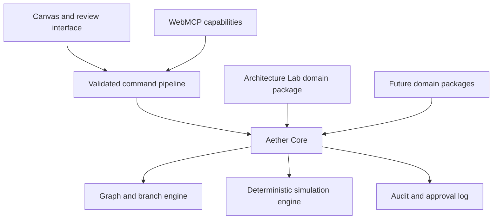

# Aether

> **Branch it. Break it. Commit with confidence.**

Aether is a counterfactual architecture laboratory. Architects and agents work on the same typed system model, create isolated design futures, run deterministic failure simulations, compare evidence, and safely merge an approved design.

**Live app:** [webmcp-production-38e5.up.railway.app](https://webmcp-production-38e5.up.railway.app)

It is not a generic whiteboard or an AI diagram generator. Architecture Lab is Aether's first domain package; the core is designed so other structured decision domains can follow without changing its command, branch, approval, or audit foundations.

## The demo moment

An architect asks what happens if a region fails during peak payment traffic. The agent traces the critical path, creates three repair branches, and runs the same deterministic outage against each. The architect directly changes the recommended branch; Aether recomputes only the affected evidence, exposes a capacity violation, and lets the architect approve the eventual merge. The agent never self-approves or bypasses product rules.

## Product principles

- **The model may propose. Aether must prove.** Language models interpret intent and suggest options; deterministic code owns state changes, validation, metrics, approval eligibility, merge, and audit.
- **One command path.** Canvas interactions and WebMCP tool calls use the same validated commands.
- **Branches are real.** Each alternative has an immutable base, ordered changes, isolated simulation results, and a semantic diff.
- **People control consequential actions.** A human must approve before a merge capability is exposed.
- **The interface is evidence-first.** Tool activity, branch state, simulation consequences, and decision history are visible in the workspace.

## Architecture



Read the detailed contracts in [docs/ARCHITECTURE.md](docs/ARCHITECTURE.md), [docs/WEBMCP.md](docs/WEBMCP.md), and [docs/PRODUCT.md](docs/PRODUCT.md).

## Stack

- TypeScript, React, Vite, Hono, and a Node server
- Shared command/domain packages with Zod-backed tool-input validation
- Browser-local workspace recovery and Railway deployment
- Top-level WebMCP Imperative API, using the official `webmcp-types` definitions
- Deterministic regional-outage, traffic-spike, and database-failure simulations

The production server supplies origin-isolation and `Permissions-Policy: tools=(self)` headers required for WebMCP. In ChatGPT’s in-app browser, Aether begins with two tools and exposes three more after a branch exists: inspection, branch creation, failure simulation, reversible proposal, and comparison. It deliberately exposes no agent approval or merge tool.

## Run locally

```bash
npm install
npm run build
PORT=3147 npm run start
```

With Chrome’s WebMCP testing flag enabled, open `http://localhost:3147`. The application degrades normally in browsers without WebMCP.

## Quality gates

```bash
npm run format:check
npm run lint
npm run test
npm run build
npm run typecheck
npm run authorship:check
```

See [docs/WEBMCP_EVALS.md](docs/WEBMCP_EVALS.md) for the deterministic and tool-choice evaluation set, and [docs/WEBMCP_COMPLIANCE.md](docs/WEBMCP_COMPLIANCE.md) for standards evidence.

## Development workflow

1. Read [AGENTS.md](AGENTS.md), this README, and [STATUS.md](STATUS.md).
2. Select the smallest unblocked task and mark it `IN_PROGRESS` in `STATUS.md`.
3. Implement one vertical slice, run the listed verification, and record evidence.
4. Mark the task `DONE` only when its acceptance criteria are met.

All repository authorship is **Sreenath <sreenathmmmenon@gmail.com>**. See `AGENTS.md` for the binding commit and attribution policy.

## Status

The live execution ledger is [STATUS.md](STATUS.md). The functional WebMCP, browser validation, Railway release, and deterministic resilience workflow are complete; remaining release tasks are the optional public demo video and Devpost publishing steps.

## License

Released under the [MIT License](LICENSE).
