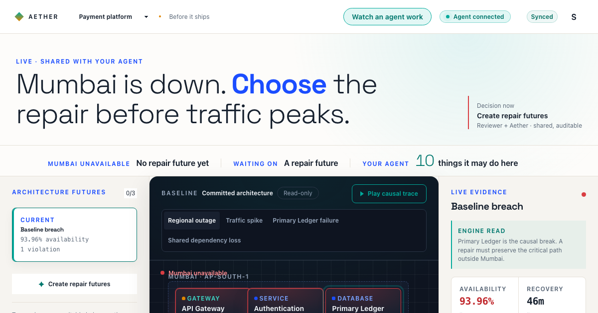
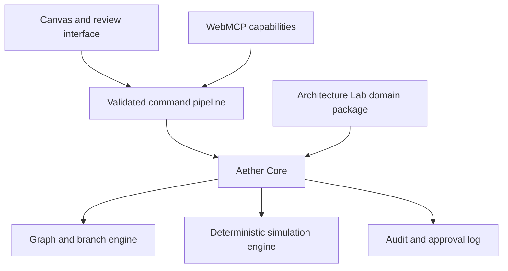

# Aether

> **The page that can tell an agent it is wrong.**

When a language model proposes a change to a running system, there is normally nothing to check it against. The agent reasons, the agent concludes, and the only thing standing between its conclusion and production is a human who has to take it on trust.

Aether makes the agent's recommendation lose an argument to a computation.

The agent finds the strongest repair for a regional outage and recommends it. Aether refuses to approve it — a traffic spike still breaches capacity. Fix that, and a third bottleneck appears that was hidden behind the first two. Only then does the approve control unlock, and only for a person: **no approve, merge, or rollback tool is registered for an agent in any state.**



## Try it

|                   |                                                                                                                                                                                 |
| ----------------- | ------------------------------------------------------------------------------------------------------------------------------------------------------------------------------- |
| **ChatGPT Sites** | **[aether-architecture-lab.sreenath-mm89.chatgpt.site](https://aether-architecture-lab.sreenath-mm89.chatgpt.site)** — open in ChatGPT's browser and the tools are simply there |
| **Railway**       | [webmcp-production-38e5.up.railway.app](https://webmcp-production-38e5.up.railway.app) — same app, same API, independent origin                                                 |

Both origins are verified live. The Sites build points at the Railway API, so
shared rooms, live sources, repository import and telemetry work identically on
either.

Open a specific system or a shared room with two optional parameters:

- `?system=` — `blank` for an empty canvas, or `payment-platform`,
  `ride-hailing`, `ai-platform`, `live-event` for the shipped examples.
- `?room=<name>` — everyone holding that link shares one workspace, reconciled
  every three seconds with optimistic versioning and stale-write rejection.

They compose: [`?system=ride-hailing&room=incident-42`](https://aether-architecture-lab.sreenath-mm89.chatgpt.site/?system=ride-hailing&room=incident-42).

## The tool surface changes with the state of the argument

Aether registers **18 tools**, and never all at once. What an agent may do is a
function of what the workspace can currently justify:

| State                  | Tools  | What just became possible                                         |
| ---------------------- | ------ | ----------------------------------------------------------------- |
| Committed architecture | **10** | Read, trace, measure, import a repo, open a future                |
| Blank canvas           | **16** | Build a system — components, dependencies, batch modelling        |
| A repair future exists | **18** | Propose changes, simulate, compare, recommend                     |
| After a human merges   | fewer  | The proposal tools withdraw — there is no open future to write to |

This is the WebMCP `ontoolchange` contract used for what it is for. Registration
is driven by `AbortController`, so tools are not hidden in the UI — they are
genuinely absent from `document.modelContext.getTools()`, and an agent asking
for one is told it does not exist.

## The human gate, in three independent layers

A gate an agent can talk its way past is not a gate. Aether's holds at three
levels that fail independently:

1. **Absence.** No approve, merge, rollback or delete tool is ever registered.
   There is nothing to call.
2. **Authority.** The reducer refuses the action outright when
   `actor.kind !== "human"` — five separate guards in
   [`src/core/branch-engine.ts`](src/core/branch-engine.ts).
3. **Unspoofability.** `actor` is a module constant, not a parameter. An agent
   cannot claim to be a person, because it is never asked who it is.

Verified live on both origins: `capacityRps: "banana"` is refused with
_"expected number, received string"_ rather than silently corrupting approved
evidence; an unknown branch id is refused and told which ids are real.

## What is measured, what is generated, and what is modelled

Aether states this plainly rather than letting an interface imply more than it
knows.

**Read live, at the moment you see them** — each reply carries the endpoint and
the timestamp. `read_live_source` reads OpenAI, GitHub, npm and Cloudflare
status pages. `measure_component_demand` reads npm's published download volume.
`read_repository_architecture` fetches a public repository's compose file. No
request carries a credential; the repository reader works on public
repositories only. The live-source proxy is an allowlist of four named sources,
**not** a URL forwarder — a proxy that forwards whatever URL a page hands it is
an open relay, and this one is reachable by anybody.

**Generated by this application** — component traffic where a component is not
mapped to a published package. Nobody points a hackathon entry at their
production observability stack. The series carries the diurnal shape real
traffic has and is deterministic, so two people reading one board see the same
numbers. Every reply names which it is, in an `origin` field.

**Modelled** — availability, recovery, latency and cost, from a deterministic
engine (`aether-sim-6`) running on the capacities the architecture declares.
Input and output fingerprints on every run prove reproducibility. Every
coefficient is a declared, commented assumption in `availabilityModel` and
`costModel`. They are **not calibrated against measured production incidents**,
and this product does not claim they are: read the output as a resilience
ranking, not an SLO.

[docs/DATA_SOURCES.md](docs/DATA_SOURCES.md) carries the full record, including
the published engineering material the shipped examples are shaped from — the
live-event fixture follows what Hotstar published at AWS re:Invent 2019
(CMY302): 25.3M peak concurrent viewers, over 1M requests per second.

## Bring your own system

A reviewer describes a system Aether has never seen. An agent builds it through
WebMCP — components, dependencies and all — or the brief parser builds it
unassisted. The same deterministic engine then proves its hidden failure paths,
and the human approves only after the evidence clears. Nothing about the demo
depends on the shipped fixtures.

## Product principles

- **The model may propose. Aether must prove.** Language models interpret
  intent and suggest options; deterministic code owns state changes,
  validation, metrics, approval eligibility, merge, and audit.
- **One command path.** Canvas clicks and WebMCP tool calls go through the same
  validated commands. There is no second, weaker door.
- **Branches are real.** Each alternative has an immutable base, ordered
  changes, isolated simulation results, and a semantic diff.
- **People control consequential actions.** A human must approve before a merge
  capability is exposed anywhere.
- **Evidence outlives its claim.** An agent's edit cannot survive the reading it
  rested on; when the evidence moves, the conclusion is re-derived.

## Architecture



Detailed contracts: [docs/ARCHITECTURE.md](docs/ARCHITECTURE.md),
[docs/WEBMCP.md](docs/WEBMCP.md), [docs/PRODUCT.md](docs/PRODUCT.md).

## Stack

TypeScript, React 19, Vite, Hono and a Node server, with PostgreSQL-backed
workspace persistence and Zod-validated tool input throughout.

WebMCP uses the top-level Imperative API against the official `webmcp-types`
definitions. The production server supplies the origin-isolation and
`Permissions-Policy: tools=(self)` headers WebMCP requires, and forwards an
optional `WEBMCP_ORIGIN_TRIAL_TOKEN` as the `Origin-Trial` header for the public
Chrome origin while the API remains experimental. Tools that mutate the
auditable workspace never claim to be read-only.

Each visitor's workspace is keyed by an unguessable identifier generated in
their browser with `crypto.getRandomValues`. The persistence endpoints validate
it on read and write, reject a body over 1&nbsp;MB before parsing, and use
optimistic versioning so a stale write is refused rather than silently
overwriting someone's decisions. There are no user accounts: anyone holding a
workspace identifier can read and write it, so it is evaluation and
demonstration state rather than a store for confidential architecture.

## Run locally

```bash
npm install
npm run build
PORT=3147 npm run start
```

With Chrome's WebMCP testing flag enabled, open `http://localhost:3147`. The
application degrades normally in browsers without WebMCP.

To build the ChatGPT Sites artifact, which is static and calls the Railway API:

```bash
VITE_AETHER_API_BASE_URL=https://webmcp-production-38e5.up.railway.app npm run build
```

## Quality gates

```bash
npm run format:check && npm run lint && npm run typecheck
npm run test          # 413 tests across 57 files
npm run evals         # 26 behavioural checks against the real tool registry
npm run build && npm run authorship:check
```

The evals are not unit tests. Each one drives the **real** registry and states
the question it is asking and the value it observed — that the ceiling binds
whichever order changes arrive in, that a breached ceiling still leaves a legal
move, that an agent cannot delete state, that the live-source proxy refuses an
arbitrary address. See [docs/WEBMCP_EVALS.md](docs/WEBMCP_EVALS.md) and
[docs/WEBMCP_COMPLIANCE.md](docs/WEBMCP_COMPLIANCE.md).

## Status

The live execution ledger is [STATUS.md](STATUS.md). WebMCP integration,
browser validation, both production deployments, and the deterministic
resilience workflow are complete, along with branch-derived topology, semantic
review, a human-only cost ceiling, live workspace synchronisation across tabs
and across people in a shared room, and Lighthouse scores of 100 for
accessibility, best practices and SEO measured against the deployed origin,
including at an emulated 412px mobile viewport.

All repository authorship is **Sreenath <sreenathmmmenon@gmail.com>**. See
[AGENTS.md](AGENTS.md) for the binding commit and attribution policy.

## License

Released under the [MIT License](LICENSE).
