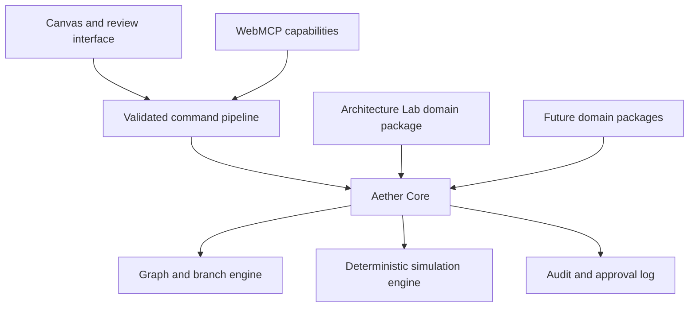

# Aether

> **Branch it. Break it. Commit with confidence.**

Aether is where an agent's proposal meets proof. When a language model suggests a change to a running system, there is normally nothing to check it against — the claim is only as good as the model's confidence. Aether makes the consequence computable: people and agents work the same typed system model, branch a change in isolation, run a deterministic failure simulation, and see what the change actually does before anyone commits it.

Architecture resilience is the domain it demonstrates. The mechanism — typed model, isolated branch, deterministic evidence, bounded agent authority, human-only commit — is what any team faces the moment they let an agent propose changes to something that matters.

**Live app:** [webmcp-production-38e5.up.railway.app](https://webmcp-production-38e5.up.railway.app)

It is not a generic whiteboard or an AI diagram generator. Describe your own architecture to an agent and it builds the model here — components, dependencies, and all — then the deterministic engine proves what a failure would do to it. Three worked systems ship for anyone who wants the story immediately, and every metric, repair alternative, and narrative re-derives from the graph you are actually looking at. Architecture Lab is Aether's first domain package; the core is designed so other structured decision domains can follow without changing its command, branch, approval, or audit foundations.

## What Aether does that other tools do not

Most architecture tools either draw the system, report an outage after it happens, or put a chatbot beside a diagram. Aether makes the decision itself a shared system object: an incident, an agent recommendation, a human constraint, every proposed change, its deterministic consequence, the discussion around it, approval, and rollback all refer to the exact same architecture future.

The opening decision room answers five questions immediately: **what is failing, what are we deciding, what does the agent recommend, what did the human say, and what action is safe next.** That makes the product useful during a design review or live incident—not just as a generated diagram.

## The demo moment

An architect enters a Mumbai payment-path outage with the decision already visible. The agent traces the critical path, creates three repair futures, and records its evidence-bound recommendation. The architect adds the cost constraint directly on the affected component, Aether recomputes only the affected evidence, and the complete human-agent discussion and command history remain replayable beside the branch diff. The agent never self-approves or bypasses product rules.

## Opening a specific system, or a shared room

The live URL takes two optional parameters.

- `?system=blank` opens an empty canvas for your own architecture. `payment-platform`, `ride-hailing`, and `ai-platform` open the shipped examples. Switching systems in the interface rewrites the address bar, so the current architecture is always shareable.
- `?room=<name>` puts everyone holding that link into one shared workspace, reconciled every three seconds with optimistic versioning and stale-write rejection. Every change stays attributable to the human or the agent that made it. Without the parameter each visitor keeps their own private workspace.

Both compose: `?system=ride-hailing&room=incident-42`.

Workspaces are unauthenticated evaluation state — see the persistence note under Stack.

## Bring your own system

A reviewer describes a system Aether has never seen, an agent builds it through WebMCP or the brief parser builds it unassisted, Aether proves its hidden failure paths on the same deterministic engine the shipped examples use, and the human approves only after the evidence clears. The original plan is in [docs/V3_REVERSE_WINNER_PLAN.md](docs/V3_REVERSE_WINNER_PLAN.md).

## What is measured, and what is modelled

Aether reads real sources. `read_repository_architecture` fetches a public
repository's compose file; `read_live_source` reads OpenAI, GitHub, npm and
Cloudflare status pages; `measure_component_demand` reads npm's published
download volume. Those readings are live, and each carries the endpoint and
the moment it was taken.

Component traffic comes from `read_component_telemetry`. Where a component
is mapped to a published package, that package's real download volume is
used. Otherwise the series is **generated by this application** — nobody
points a hackathon entry at their production observability stack, and a
reviewer should not be asked to. Every reply names which of the two it is,
in an `origin` field.

The generated series is not noise: it carries the diurnal shape real traffic
has, a trough overnight and a peak in the working day, and it is
deterministic — the same component always produces the same series, so two
people reading one board see the same numbers and a run can be reproduced
tomorrow.

The consequences are **modelled**. Availability, recovery and latency come
from a deterministic engine running on the capacities the architecture
declares — reproducible, which the input and output fingerprints on every run
prove, and not the same thing as measured production telemetry. A weekly
download total is a mean over its window rather than a peak, and it stands in
for a component's demand rather than being that component's traffic.

Incident threads are opened from the architecture: a database with no standby,
a component that cannot absorb a 1.5x spike, the region holding the write
path. They are not yet driven by a live alerting feed.

The interface reads as live telemetry because that is what an incident room
looking at its own system should feel like. This section is where the
distinction is recorded, rather than as a footnote on every number a room is
trying to act on.

## Product principles

- **The model may propose. Aether must prove.** Language models interpret intent and suggest options; deterministic code owns state changes, validation, metrics, approval eligibility, merge, and audit.
- **One command path.** Canvas interactions and WebMCP tool calls use the same validated commands.
- **Branches are real.** Each alternative has an immutable base, ordered changes, isolated simulation results, and a semantic diff.
- **People control consequential actions.** A human must approve before a merge capability is exposed.
- **The interface is evidence-first.** Tool activity, branch state, simulation consequences, component-anchored discussion, and replayable decision history are visible in the workspace.

## Architecture



Read the detailed contracts in [docs/ARCHITECTURE.md](docs/ARCHITECTURE.md), [docs/WEBMCP.md](docs/WEBMCP.md), and [docs/PRODUCT.md](docs/PRODUCT.md).

## Stack

- TypeScript, React, Vite, Hono, and a Node server
- Shared command/domain packages with Zod-backed tool-input validation
- PostgreSQL-backed per-visitor workspace persistence, optimistic writes, and Railway deployment

Each visitor's workspace is keyed by an unguessable identifier generated in
their browser with `crypto.getRandomValues` and held in local storage. The
persistence endpoints validate that identifier on read and write, reject a
body over 1&nbsp;MB before parsing it, and use optimistic versioning so a
stale write is refused rather than silently overwriting someone's decisions.
There are no user accounts: anyone holding a workspace identifier can read and
write that workspace, so it is evaluation and demonstration state rather than a
store for confidential architecture.

- Top-level WebMCP Imperative API, using the official `webmcp-types` definitions
- Deterministic dependency-graph simulation of regional outage, traffic spike, database failure, and shared-dependency failure

The production server supplies origin-isolation and `Permissions-Policy: tools=(self)` headers required for WebMCP. In ChatGPT’s in-app browser, Aether begins with ten state-aware tools—decision record, repository import, live-source reading, summary, failure-domain inspection, dependency trace, and isolated branch creation. Component creation, batch architecture modeling, dependency creation, deterministic simulation, and a bounded component-anchored decision note appear whenever the model is editable, which includes an empty canvas a reviewer is filling with their own system. Reversible proposal and comparison require a repair future, bringing the surface to eighteen. Tools that mutate the auditable workspace never claim to be read-only. It deliberately exposes no agent approval or merge tool. The server also forwards an optional `WEBMCP_ORIGIN_TRIAL_TOKEN` as the `Origin-Trial` header, which is required for the public Chrome origin while the API remains experimental.

## Run locally

```bash
npm install
npm run build
PORT=3147 npm run start
```

With Chrome’s WebMCP testing flag enabled, open `http://localhost:3147`. The application degrades normally in browsers without WebMCP.

## Quality gates

```bash
npm run format:check
npm run lint
npm run test
npm run build
npm run typecheck
npm run authorship:check
```

See [docs/WEBMCP_EVALS.md](docs/WEBMCP_EVALS.md) for the deterministic and tool-choice evaluation set, and [docs/WEBMCP_COMPLIANCE.md](docs/WEBMCP_COMPLIANCE.md) for standards evidence.

## Development workflow

1. Read [AGENTS.md](AGENTS.md), this README, and [STATUS.md](STATUS.md).
2. Select the smallest unblocked task and mark it `IN_PROGRESS` in `STATUS.md`.
3. Implement one vertical slice, run the listed verification, and record evidence.
4. Mark the task `DONE` only when its acceptance criteria are met.

All repository authorship is **Sreenath <sreenathmmmenon@gmail.com>**. See `AGENTS.md` for the binding commit and attribution policy.

## Status

The live execution ledger is [STATUS.md](STATUS.md). The functional WebMCP, browser validation, Railway release, and deterministic resilience workflow are complete. The current release also includes branch-derived topology, semantic review, a human-only cost ceiling, live workspace synchronization across tabs and across people in a shared review room, and Lighthouse scores of 100 for accessibility, best practices, and SEO measured against the deployed origin on 2026-09-01, including at an emulated 412px mobile viewport. The remaining release tasks are the required public demo video and the Devpost submission.

## License

Released under the [MIT License](LICENSE).
